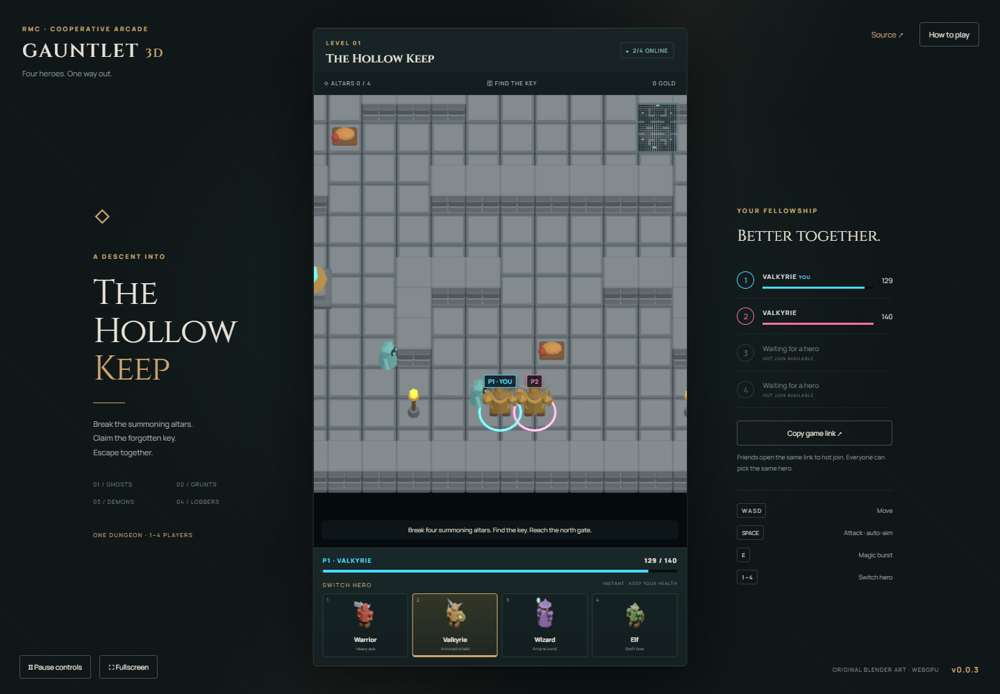

# Gauntlet Clone 3D

A cooperative 3D dungeon crawler for 1–4 browser players, inspired by Gauntlet. Original low-poly Blender heroes, monsters and dungeon assets; Babylon Lite renders the world with WebGPU.

## Live Demo

[Play Gauntlet 3D](https://samuelasherrivello.github.io/babylon-lite-gauntlet-clone-3d/) · [Release v0.0.3](https://github.com/SamuelAsherRivello/babylon-lite-gauntlet-clone-3d/releases/tag/v0.0.3)

Open the same link on up to four devices. Use current Chrome or Edge with WebGPU enabled.



## Play

Destroy four summoning altars, collect the key, and reach the northern gate. Ghosts chase, grunts strike, demons shoot, and lobbers throw telegraphed bombs. Food heals; treasure adds party gold. One complete handcrafted level supports solo play or 2–4 cooperating players.

Choose Warrior, Valkyrie, Wizard, or Elf at any time using the four portrait buttons. Duplicate classes are allowed; player numbers, colored rings, labels, and health bars distinguish everyone. Switching retains health percentage and ability cooldowns.

| Control | Action |
| --- | --- |
| WASD / arrows | Move |
| Hold Space | Attack with automatic targeting |
| E | Magic burst, 10-second cooldown |
| 1–4 / portrait buttons | Instantly switch hero |
| Touch joystick + Attack / Magic | Mobile controls |
| Escape / Pause controls | Stop local controls; the shared world continues |

After victory or party defeat, the lowest active player number can restart. A fallen player waits for allies to finish. Open the same game URL to hot join the public four-seat room; a fifth player receives a full-room message and can retry when a seat opens.

## Development

Use Node.js 24 and npm. A current Chrome or Edge with WebGPU and hardware acceleration is required.

```sh
npm ci
npm run dev
npm test
npm run build
npm run preview
```

Vite prints the local URL, including `/babylon-lite-gauntlet-clone-3d/`. No secrets are needed. The default client connects to the public backend. For isolated development, run the [shared server](https://github.com/SamuelAsherRivello/rmc-colyseus-multiplayer-server) and set `VITE_SERVER_URL` to its origin before starting Vite.

`npm run test:browser` uses installed Chrome and two isolated browser contexts, then completes the level through keyboard controls and checks a touch viewport. Its default URL is the dev server on port 5186; override `GAME_URL` if needed. Run it against an isolated backend because it plays and restarts the room. `node project-name/test/recovery.mjs` additionally verifies natural defeat, restart, disconnect/retry, unsupported WebGPU, and simultaneous touch cancellation. Touch is emulated; physical mobile hardware has not been tested.

## Architecture and artwork

- `project-name/src/main.js`: shared client, HUD, keyboard/touch input, recovery states.
- `project-name/src/view.js`: Babylon Lite WebGPU scene, pooled GLB instances, camera and player labels.
- `project-name/art/dungeon-kit.blend`: editable original models; `build_assets.py` records their construction.
- `project-name/public/assets`: sixteen original GLBs and four rendered hero portraits.
- Server-authoritative collision, enemies, combat, pickups, objectives and restart run in the shared `gauntlet-3d` room. The game pins the released `@rmc/multiplayer-client` v0.5.0 GitHub asset.

Imported skills are real files in `.agents/skills`. Explore and apply were used for four major systems: network/session lifecycle and combat/level rules in the shared server; dungeon artwork and browser client in this repository. OpenSpec holds their acceptance specifications and implementation records.

## Release

The checked-in **Release** GitHub Actions workflow tests/builds, increments the patch number in `version.txt`, commits, tags, and publishes a GitHub release. Then dispatch **Deploy live demo** on `main` because bot commits do not trigger push workflows. Pages builds with the repository subpath; verify the displayed version and actual gameplay after deployment.

Sessions are temporary and public, without accounts, private room codes, host migration, or persistence. Reloading creates a fresh player. Server restarts reset the level. This small game intentionally has one level and no audio.

## Original AI Prompt

<details>
<summary>Original request and follow-up</summary>

```text
[$rmc-game-creator](C:\Users\srive\\.agents\skills\rmc-game-creator\SKILL.md) Create a new MULTIPLAYER game in a public repo.
Using this template: https://github.com/SamuelAsherRivello/github-repository-template

Import these codex skills to use to make art https://github.com/SamuelAsherRivello/ai-skills-blender/

This is a 3d version of the top-down classic game Gauntlet.

https://en.wikipedia.org/wiki/Gauntlet_(1985_video_game)

Remake: https://store.steampowered.com/app/258970/Gauntlet_Slayer_Edition/

Have one complete level with 4 enemies taken from the real game.

Its 3d, topdown view. Create your own world assets and players. Use a imple stylized but identifiable set of assets using the https://github.com/SamuelAsherRivello/ai-skills-blender/ codex skills here.

Offer 4 selectable characters. The player hot joins, then on the ui there are 4 buttons for them to instantly switch to nother player.

The game supports 1-4 players. Dynamically color each player or its in-world ui on th eplayer a unique color so 2+ players can choose the same character yet still distinguis themselves arpart.
```

Follow-up:

```text
import these skills and use the explore and apply for each major system in the game. https://github.com/SamuelAsherRivello/ai-skills-library/. Optional is to use other skills too.
```

Links above preserve the supplied destinations; chat-specific link formatting is normalized.
</details>

## Credits

Created for Samuel Asher Rivello / Rivello Multimedia Consulting. [Portfolio](https://www.samuelasherrivello.com/) · [GitHub](https://github.com/SamuelAsherRivello).

Based on [GitHub Repository Template](https://github.com/SamuelAsherRivello/github-repository-template). See [provenance](project-name/documentation/provenance.md) and [artwork verification](project-name/documentation/artwork.md). Gauntlet is a gameplay reference; this project uses original artwork and is not an official Atari or Warner Bros. release.
